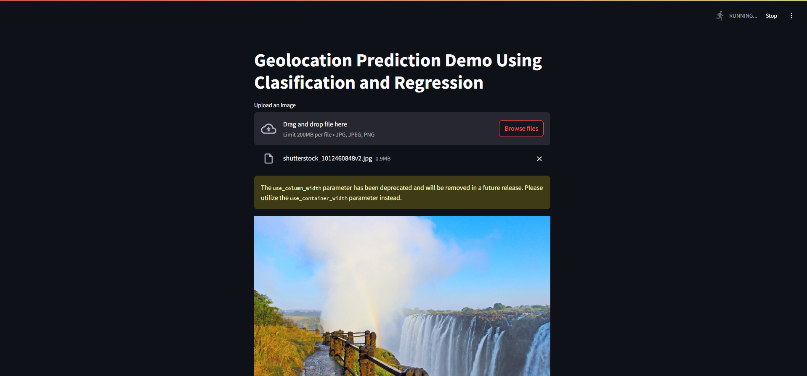
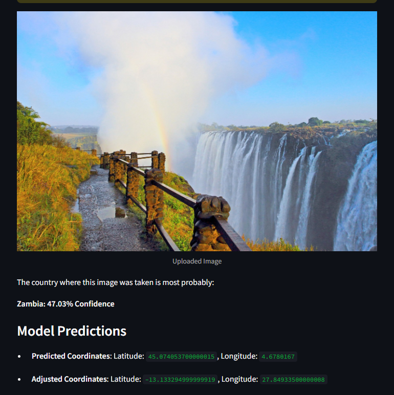
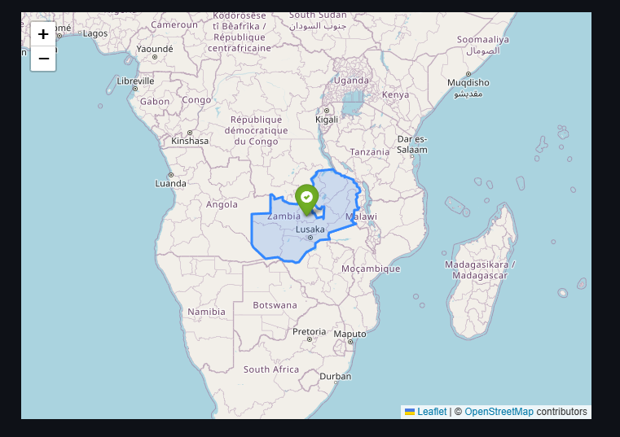
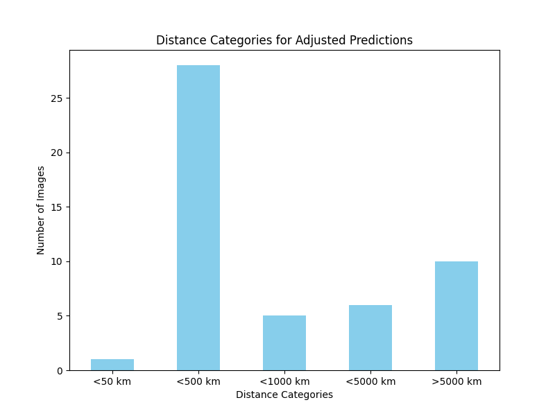
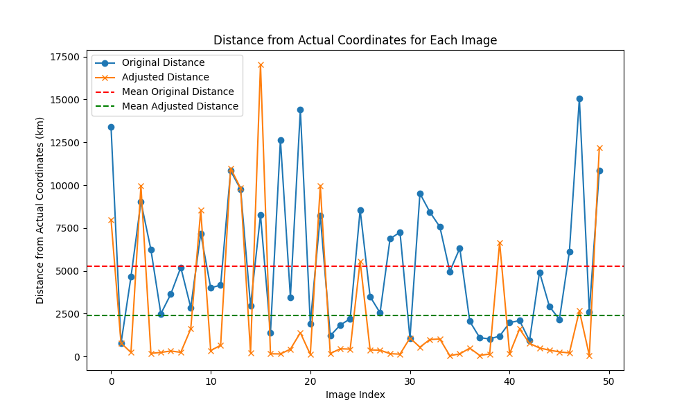
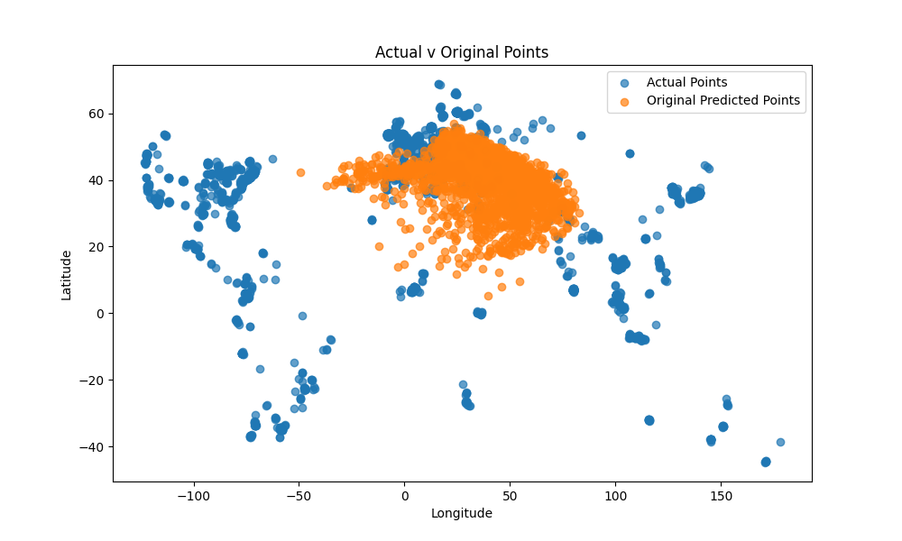
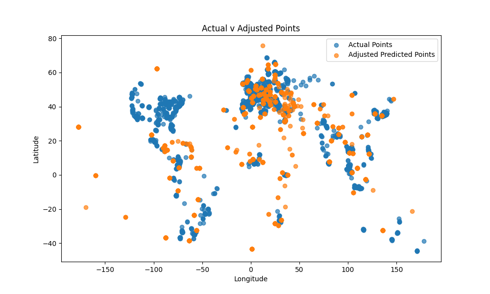

# Hybrid Geolocation Approach: Using StreetCLIP and Boundary-Based Regression. 
## COMP 5790/6790: Computer Vision.
### Shyam Patel - Term Project

## Introduction
This is the term project for COMP 5790/6790 - Computer Vision. This project was developed by Shyam Patel and it explores the current problems in the Geolocation space in the Computer Vision field. This repository contains all the files I developed as well as a ui.py file to display a demo that is functional. I have removed the dataset from this repository but you can find and download it here: https://huggingface.co/datasets/rohanmyer/geotagged-streetview-images or https://www.kaggle.com/datasets/rohanmyer/geotagged-streetview-images-15k

## Features
- 📍 **Boundary-Constrained Predictions**
- 🚀 **Accurate Adjustments**
- 🔍 **Comprehensive Visualizations**
- 📺 **User Interface**

## Setup
I used WSL on VSCode and prefered to use a venv over conda, but both can work. The requirement.txt contains all the packages needed to run the code - I would use a venv.
To setup your environment run these commands.
Clone the repository and install dependencies (Linux):
```bash
sudo apt update
python -m venv geolocate
source geolocate/bin/activate
git clone https://github.com/shyam-185/COMP6710.git
cd Computer-Vision
pip install -r requirement.txt
```
The next thing to do is to install git lfs to use the regression_model.pkl file. Visit their site and download it for your machine. Once that is done, make sure it's in COMP6710 dir.
https://git-lfs.com/ - follow the instructions on their page to properly install git lfs, then follow the ones below:
```bash
git lfs install
git lfs pull
streamlit run ui.py
```
The webpage should pop up. If you have connection issues, try opening Network URL rather than Local URL.

## UI Webpage




## Evalutaion






## References
Final Report which goes over everything. Please give it a read!
#TODO add link
 
